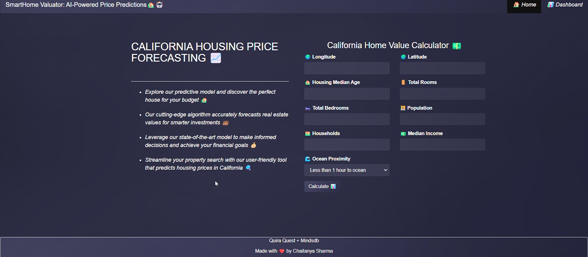

# SmartHome Valuator: AI-Powered Price Predictions🏡🤖

SmartHome Valuator is an open-source web app that uses MindsDB AI & Node.js to predict or forecast house prices in California. The prediction is based on a trained machine-learning model developed using historical data on house prices in California.

SmartHome Valuator is a powerful web application that can provide valuable insights to anyone who is interested in buying or selling property in California.

## Table of Contents
- [License](#license)
- [Demo](#demo)
- [Screenshot](#screenshot)
- [Tech Stack](#tech-stack)
- [System Requirements](#system-requirements)
- [Project Flow](#project-flow)
- [Installation](#installation)
- [Tutorial](#tutorial)
- [FAQ](#faq)

### License
[MIT](https://choosealicense.com/licenses/mit/)

### Demo


#### Demo Video
[](https://youtu.be/6_l3GrxRVGo)

### Screenshot


## Tech Stack

- HTML, Bootstrap 3, Chart.js, EJS template engine, MindsDB JavaScript SDK (Frontend).
- Express, Node.js (Backend).
- MindsDB (Machine Learning, AI Tables)


## System Requirements

- 4 core CPU (Intel or AMD).
- 6 GB RAM.
- 30 GB hard disk.
- Installed latest Docker Engine.
- Installed latest Node.js & npm.
- Windows OS.
- 4 GB data to download MindsDB Docker image.

## Project Flow

- A user who wants to predict the house price in CA can visit the site home page.
- In the form, the user has to enter the values required to predict the house price in CA.
- After submitting the form, the request is sent to the MindsDB server by the Node.js server to predict the house price for the given input.
- The Node.js server gets the response from the MindsDB server with the data.
- On the result page, the value of the house price, ocean proximity, along with the California median values by ocean proximity is displayed.
- The user can view the average number of rooms, median price in CA over time in the bar chart & scatter plot by clicking the dashboard page on the upper right of the home page.

## Installation

Steps to run the app on localhost (Windows):

1. **Clone the project from GitHub:**
    ```bash
    git clone https://github.com/sharmachaitanya945/Smarthome-valuator-Ai.git
    ```
2. **Navigate to the project directory:**
    ```bash
    cd Smarthome-valuator-Ai
    ```
3. **Install the dependencies:**
    ```bash
    npm install
    ```
4. **Install the latest version of MindsDB Docker Image (Docker Engine must be installed on your local machine):**
    ```bash
    docker pull mindsdb/mindsdb

    ```
5. **Download the dataset from Kaggle:**
    [California Housing Prices Dataset](https://www.kaggle.com/datasets/camnugent/california-housing-prices)
6. **Run this command to start MindsDB in Docker:**
    ```bash
    docker run -p 47334:47334 -p 47335:47335 mindsdb/mindsdb
    ```
7. **Go to `http://localhost:47334` & select the option to upload the data through files (.csv).**
8. **Import the `housing.csv` & give `home_table` as the name of the table in the datasource name field.**
9. **After you press save, it will import data to the files database and create `home_table` in the files.**
10. **Once the table is created, you have to create & train the model with the data:**
    #### Train the Model:
    ```sql
    CREATE MODEL mindsdb.home_model
    FROM files
    (SELECT * FROM home_table)
    PREDICT median_house_value;
    ```
    #### Predict the model:
    ```sql
    SELECT median_house_value
    FROM home_model
    WHERE longitude='-122.23' AND
    latitude=37.88 AND
    housing_median_age=41 AND
    total_rooms=880 AND
    total_bedrooms=129 AND
    population=322 AND
    households=126 AND
    median_income=8.3252 AND
    ocean_proximity='NEAR BAY';
    ```
11. **Now you can write the query & predict the value in the MindsDB editor.**
12. **Start the Node.js server on your machine:**
    ```bash
    node app.js
    ```

## Tutorial

Read the complete tutorial on my Medium blog: [Predicting House Prices in CA Using MindsDB AI](https://blog.sharmachaitanya945.com/homescopeca-webapp-using-mindsdb)

## FAQ

#### How Can I use MindsDB Cloud in this project?
Yes, you can use MIndsdb by installing its docker image container by pulling it from its source.

#### Which dataset did you use in the project?
I used the California Housing Prices dataset from Kaggle, which contains more than 20,000 rows.

#### How long does it take to train the dataset?
it depends on your configuration the configuration i used it took me 25 minutes to do so.

## Contributing

This repository is open for contributions and new features. If you have suggestions for improvements, feel free to fork the repository, make your changes, and submit a pull request. Your contributions are highly appreciated!
